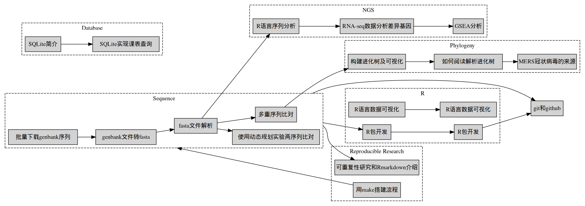

## Course schedule

The figure was generated by [workflow.R](workflow.R).

## Data

+ [test.db](data/test.db)
+ parsing fasta
    - [flu_seq.fas](data/flu_seq.fas)
    - [flu_seq_v2.fas](data/flu_seq.fas)
+ parsing genbank
    - [AB115403.gb](data/AB115403.gb)    
    - [AB115403.fasta](data/AB115403.fasta)
    - [some gb files](data/gb)
+ [GEO](data/GEO)

## R package

+ [bioinfo.practice](bioinfo.practice)
    - demo functions you need to implement in the class
+ [buffalo](buffalo)
    - demo R package development

## Links and resources

+ SQLite
    - <https://www.sqlite.org/aff_short.html>
    - [How to Use SQLite with R](https://www.bioconductor.org/help/course-materials/2006/rforbioinformatics/labs/thurs/SQLite-R-howto.pdf) 
    - [RSQLite Tutorial](https://github.com/ysquared2/RSQLiteTutorial)
    - [SQLite in R](https://www.datacamp.com/community/tutorials/sqlite-in-r)
    - [A Gentle Introduction to SQL Using SQLite](https://a-gentle-introduction-to-sql.readthedocs.io/en/latest/)
+ GenBank 
    - <https://www.ncbi.nlm.nih.gov/Sitemap/samplerecord.html>
    - <https://www.ncbi.nlm.nih.gov/nuccore/AB115403>
    - <https://www.ncbi.nlm.nih.gov/books/NBK25501/>
+ Alignment
    - <https://www.nature.com/articles/nbt0704-909>
        - [global.c](global.c)
    - <https://developer.ibm.com/articles/j-seqalign/>
    - <https://www.geeksforgeeks.org/sequence-alignment-problem/>
+ Make
    - [Make命令教程](http://www.ruanyifeng.com/blog/2015/02/make.html)
    - [A simple makefile tutorial](http://www.cs.colby.edu/maxwell/courses/tutorials/maketutor/)
    